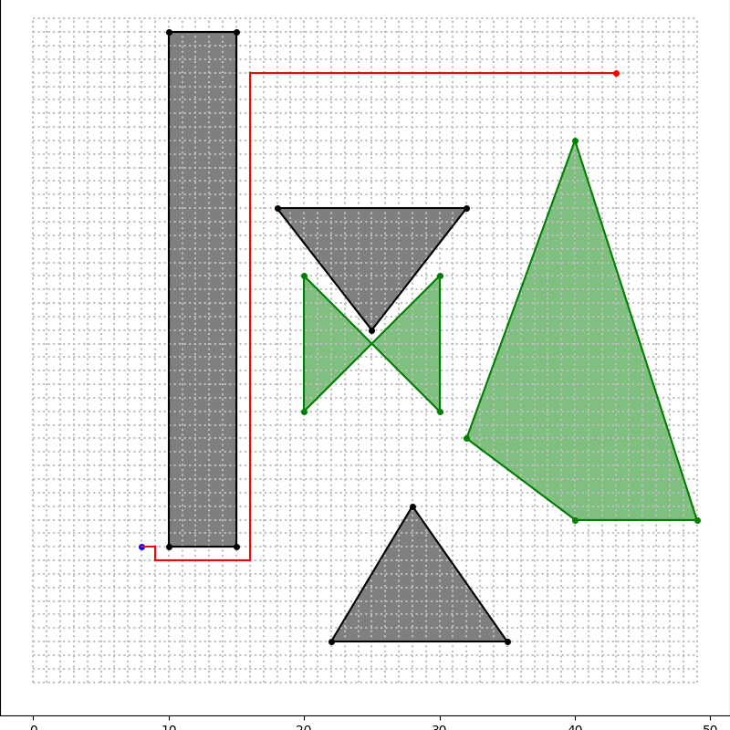
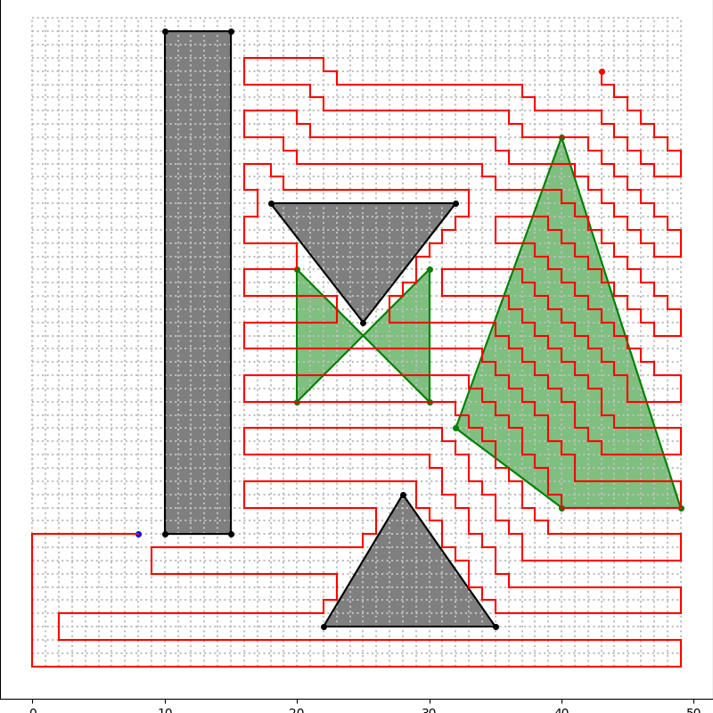
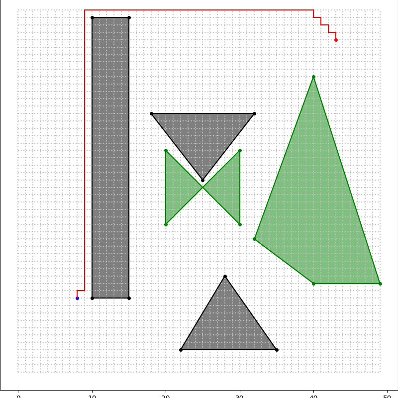
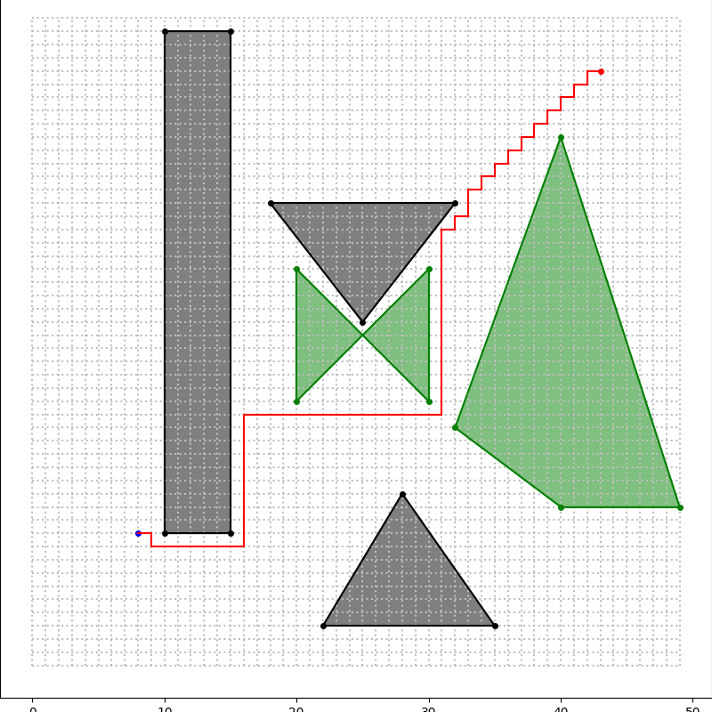

# AI Grid Pathfinder
>A 2D grid pathfinding agent that uses AI search algorithms to navigate from point A to point B while avoiding obstacles and considering terrain costs

## Features
* Modular implementations of BFS, DFS, GBFS, and A* algorithms for pathfinding.
* Real-time visualization using Matplotlib, with path rendering and keyboard exit controls (q, ESC).
* Polygon-based spatial detection for enclosures and turfs, with polygon, edge, and corner checks.
* Weighted movement costs applied per step, with extra cost when crossing turf.
* Grid world is defined by txt files supporting custom enclosure and turf geometry.

## Breadth First Search (BFS)
* Expands outward one layer at a time, checking all neighbors before moving further. Always finds the shortest path in unweighted maps, but can be slow in larger grids.
<p align="center">
  
</p>

## Depth First Search (DFS)
* Expands down one path before backtracking. Fast and simple, but doesn't guarantee the shortest path and can easily get stuck in dead ends.
<p align="center">
  
</p>

## Greedy Best First Search (GBFS)
* Expands to node that looks closest to the goal based on a heuristic. Fast and goal-driven, but can miss shortest path if it gets tunnel vision.
<p align="center">
  
</p>

## A-star Search (A*)
* Combines actual path cost with heuristic to evaluate nodes. Guarantees shortest path when using an admissible heuristic.
<p align="center">
  
</p>

## How to Run
Clone this repository
```bash
git clone https://github.com/DavidSchineis/AI-Grid-Pathfinder.git
```

Ensure Python 3.11+ is installed and install required libraries:
```bash
pip install -r assets/requirements.txt
```

Run the simulation:
```bash
python3 main.py
```
